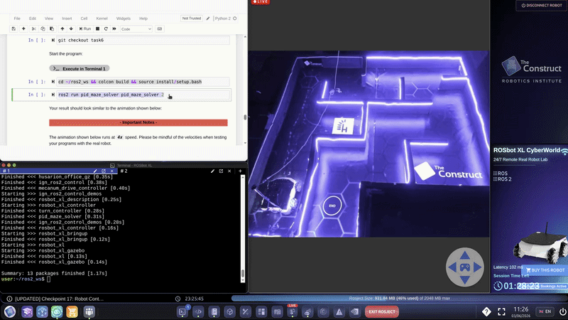

# PID Maze Solver

A ROS 2-based maze navigation system that uses **PID controllers**, **LiDAR**, and predefined waypoints to autonomously navigate a maze.



## Overview

The robot navigates through a sequence of predefined waypoints using two PID controllers:

- **Turning PID** — controls the robot's orientation toward the next waypoint.
- **Movement PID** — controls the robot's distance to the waypoint.

During navigation, LiDAR data is used for course correction and wall avoidance.

The robot repeats the following sequence:

```text
Turn → Move → Turn → Move → ... → Stop
```
The robot stops automatically after reaching the final waypoint.

**Keywords**: ROS 2, C++, PID Control, LiDAR, Waypoint Navigation, ROSbot XL

### Dependency

This project depends on the following ROS 2 package:

* [distance_controller](https://github.com/Akitsuyoshi/distance_controller)

### Run

This project was developed and tested on The Construct CP17 ROSject.

### Simulation

Build the workspace:

```bash
cd ~/ros2_ws
colcon build
source install/setup.bash
```

Launch the maze simulation:

```bash
ros2 launch rosbot_xl_gazebo simulation.launch.py
```

Run the app:

```bash
cd ~/ros2_ws
source install/setup.bash
ros2 run pid_maze_solver pid_maze_solver
```

### Real robot

2 selects the real robot mode

```bash
cd ~/ros2_ws
source install/setup.bash
ros2 run pid_maze_solver pid_maze_solver 2
```